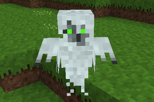

### Mobs Ghost Redo
 
**_Adds a ghost mob._**

**NOTE:** This is Blockmen's CME Ghost mob ported to Mobs Redo, and tweaked.

**Version:** 0.2.0 
**Source code's license:** GPL v3.0 
**Media (Textures, Models, Sounds) license:** CC-BY-SA 4.0 International.

**Dependencies:** default, bones (found in Minetest Game), mobs (Mobs Redo) 

### Installation

Unzip the archive, rename the folder to mobs_ghost_redo and place it in 
../minetest/mods/

If you only want this to be used in a single world, place it in 
../minetest/worlds/WORLD_NAME/worldmods/

GNU+Linux - If you use a system-wide installation place it in 
~/.minetest/mods/

For further information or help see: 
https://wiki.minetest.net/Help:Installing_Mods